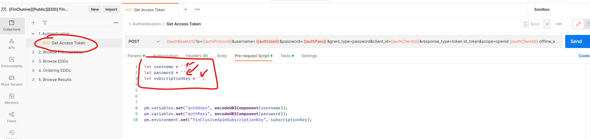

# FinClusive EDD API

This repo contains Postman collections and environments that present API interaction with FinClusive's EDD API.

 - Obtaining the Auth Context (bearer token)
 - Browsing Prerequisite Data (EDD Components, Scheduling strategies, etc.)
 - Ordering EDDs (for clients and/or significant parties)
 - Browsing EDD Results

---

## Authentication Prerequisites

Before interacting with the API you'll need the following:

 - **Username**
 - **Password**
 - **Subscription Key** 

All these for the environment with which you want to interact (**Sandbox** or **Production**)

After importing the environments and collections in Postman, you'll need to input these parameters in the **Pre-Request Script** section of the **1. Authentication -> Get Access Token** Request

---

---

> Make note that the **Get Access Token** Request will **set the required security context** environment variables for all the subsequent requests, so after you run it, there's **no need to do anything else** in terms of security (**no copy-paste** of **tokens** in **headers**)

---

## Params in Pre-Request Script

Some of the other requests also have some parameters that need to be defined in the **Pre-Request Script** section, but are pretty obvious.

 - For Request EDD: the client FincID and/or sig. party ID needs to be specified.
 - For EDD Results: the EDD order ID needs to be specified
 - For EDD Attachment Download: the attachment ID needs to be specified
